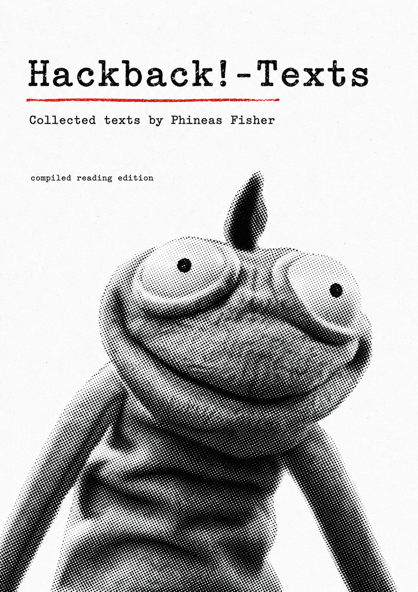

# Hackback!-Texts

  

## A curated reading edition of texts by Phineas Fisher

This repository is a simple reading compilation of public texts attributed to Phineas Fisher.

It is organized in reading order so the texts can be read as a single collection, like a short digital book.

This project is intended for historical, political, and cybersecurity reading and research.

---

## Reading order

1. [Hackback - A DIY GUIDE II](01-hackback-a-diy-guide-ii.md)
2. [Hackback - A DIY GUIDE 1](02-hackback-a-diy-guide-1.md)
3. [Hack Back — A DIY Guide (Hacking Team)](03-hack-back-a-diy-guide-hacking-team.md)
4. [Hack Back](04-hack-back.md)